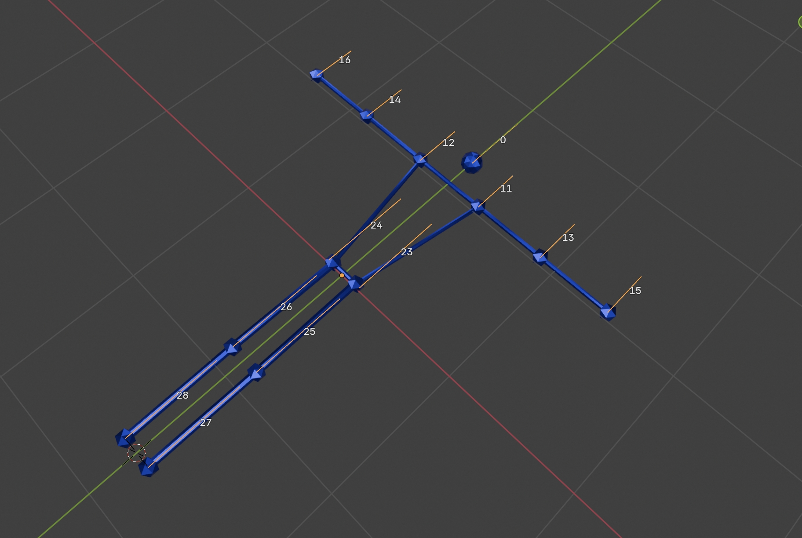

## Sample: Pose Detection

This sample builds an application for PICO using the
SecureMR APIs. The application demos how to use the
SecureMR APIs for data-driven skeleton animation.
Users will find the app can render "stick man" animations
according to the detected human being's poses.

The sample deploys an open-sourced pose detection from
MediaPipeline via SecureMR, and renders a pose marker of
glTF 2.0 format.

### Render

The render asset we are using contains only one
mesh object, namely the "Stickman".
It has 11 vertex groups, each of which
corresponds to one skeleton bone whose local transform
will be updated by the outputs from the pose detection
algorithm. 

The following screenshot shows the schema of the armature
and the mesh object: 

Note in this armature schema, each bone's name is the
index of its corresponding keypoint among the
model detection outputs (33 in total, but we only use
13 for the 13 bones).

In our demo codes, we extract the corresponding keypoints
from the pose detection model's outputs, calculate
the transform matrices from the keypoints and apply them
on each bones. Object "Fireman" is thereafter being
animated and the ball markers for joints are aligned
with the detected human body. 

### Code walk-through

There are eight pipelines involved in this sample. Don't panic, not 
all of the eight are routinely executed during run time.

1. The VST pipeline, `m_secureMrVSTImagePipeline`, which is called at 20Hz, aims to
   query the camera for the left-eye image, stored in global tensor `vstOutputLeftUint8Global`
   and `resizedLeftFp32Global`, in a 512x512 uint8 and a 128x128 float32 formats respectively. 
2. The `m_secureMrDetectionPipeline` is one of the key pipelines, where the pose detection is executed.
   It intakes the 128x128 float32 image in `resizedLeftFp32Global`, and determine (1) whether a human
   body is contained in the image in `isPoseDetectedGlobal` and (2) the affine matrix to crop region
   of interest from the original 512x512 image, in `roiAffineGlobal`
3. The `m_secureMrAffineUpdatePipeline` stabilizes the affine matrix in `roiAffineGlobal`. The output
   affine matrix is stored in `roiAffineUpdatedGlobal`. 
4. The `m_secureMrLandmarkPipeline` is the other key pipeline, where a second algorithm, namely
   "pose landmark" is executed, which intakes the affine matrix from  `roiAffineUpdatedGlobal`,
   and the original 512x512 image in `vstOutputLeftUint8Global`, and outputs the 3D poses of 13
   "landmark" describing the posture. The 13 landmarks correspond to nose, left/right shoulders,
   left/right elbows, left/right wrists, left/right hips, left/right knees and left/right feet. 
   Each landmark pose is expressed as a 4x4 transform matrix, describing its 3D poses relative to
   the center of the human body (somewhere close to belly buttons). The output is stored in 
   `bodyLandmarkGlobal` tensor. 
5. The `m_secureMrRenderingPipeline` updates the skeleton animation using the 13 4x4 matrices in
   `bodyLandmarkGlobal`. It is executed in 50Hz as well. 
6. The `m_secureMrMovePipeline` adjust the world pose of the animation asset. It is only invoked when
   a controller action is captured via `UpdateHandPose`. 
7. There is also another one-time pipeline, namely the `initPipeline` called in
   `PoseDetector::CreateGlobalTensor`. It starts the rendering after the glTF asset is loaded, and
   determine the initial pose. 

Note that even though is the `m_secureMrRenderingPipeline` is called as 50Hz, the renderer is still
running at full speed, and can achieve 90Hz. The pipeline is for updating the skeleton animations.
Hence, the local transforms of each skeleton bones is updated at 50Hz, whereas the renderer is
running in parallel and at a different cadence to the pipeline. 

